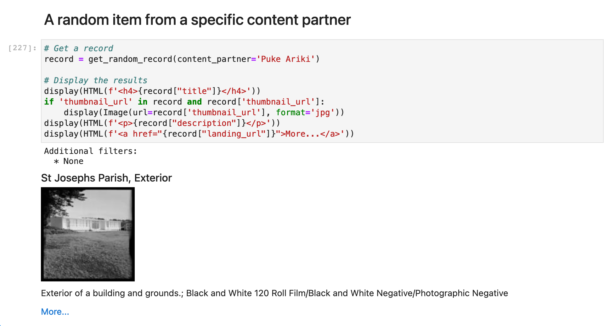
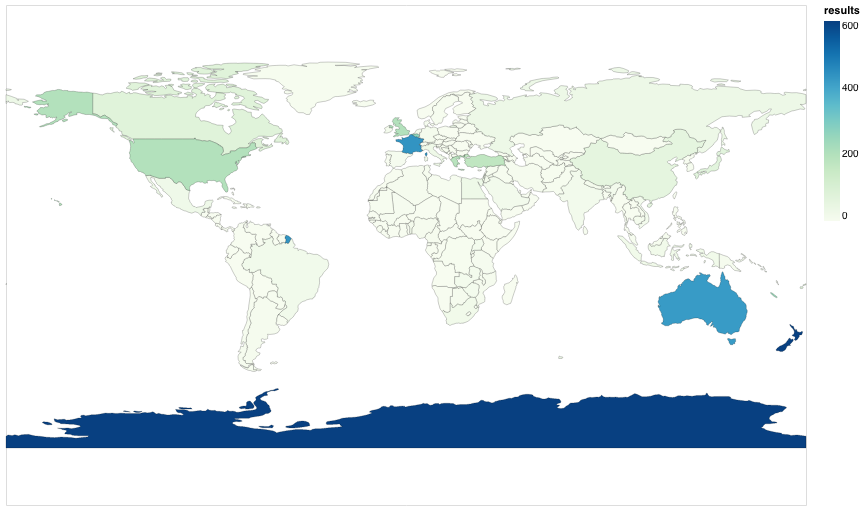
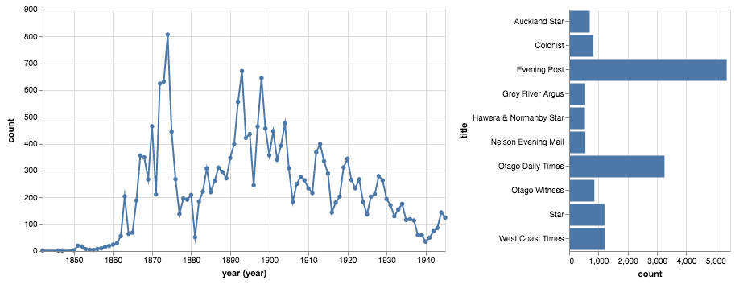

# Digital NZ

[DigitalNZ](https://digitalnz.org/) aggregates collections from across New Zealand and makes the aggregated metadata available [through an API](https://digitalnz.org/developers).

You'll need an [API key](https://digitalnz.org/developers/getting-started) to work with DigitalNZ data.

## Tips, tools, and examples

### Build a DigitalNZ API search query

This notebook creates a form that you can use to experiment with the DigitalNZ search API.

* [Download from GitHub](https://github.com/GLAM-Workbench/digitalnz/blob/master/build_api_query.ipynb)
* [View using NBViewer](https://nbviewer.jupyter.org/github/GLAM-Workbench/digitalnz/blob/master/build_api_query.ipynb)
* [Run as an app live on Binder using Voila](https://mybinder.org/v2/gh/GLAM-Workbench/digitalnz/master?urlpath=voila%2Frender%2Fbuild_api_query.ipynb)

### Getting some top-level data from the DigitalNZ API  

This notebook pokes around at the top-level of DigitalNZ, mainly using facets to generate some collection overviews and summaries.

* [Download from GitHub](https://github.com/GLAM-Workbench/digitalnz/blob/master/Top-level-data-in-DigitalNZ.ipynb)
* [View using NBViewer](https://nbviewer.jupyter.org/github/GLAM-Workbench/digitalnz/blob/master/Top-level-data-in-DigitalNZ.ipynb)
* [Run live on Binder](https://mybinder.org/v2/gh/GLAM-Workbench/digitalnz/master?urlpath=lab/tree/Top-level-data-in-DigitalNZ.ipynb)

### Harvest facet data from DigitalNZ

This notebook explores what facets are available from the DigitalNZ API and demonstrates how to harvest data from them. It generates a summary of all available facets, as well as saving the full set of values from each facet as a CSV file.

* [Download from GitHub](https://github.com/GLAM-Workbench/digitalnz/blob/master/harvest_facet_data.ipynb)
* [View using NBViewer](https://nbviewer.jupyter.org/github/GLAM-Workbench/digitalnz/blob/master/harvest_facet_data.ipynb)
* [Run live on Binder](https://mybinder.org/v2/gh/GLAM-Workbench/digitalnz/master?urlpath=lab/tree/harvest_facet_data.ipynb)

### Select a random(ish) record from DigitalNZ

The DigitalNZ API doesn't provide a random sort option. You can jump to a randomly selected page of results, but you can't do any deeper than 100,000 pages into a results set (that's 1,000,000 records if you set the per_page value to 100). So we need to find some way of filtering the results until there's less than 1,000,000, then we can grab a random page and record. This notebook examines the available facets, then uses them to reduce the size of the results set until it's possible to select a random record. It provides a series of examples of retrieving random records using different filters and facets.

* [Download from GitHub](https://github.com/GLAM-Workbench/digitalnz/blob/master/select_a_random_record.ipynb)
* [View using NBViewer](https://nbviewer.jupyter.org/github/GLAM-Workbench/digitalnz/blob/master/select_a_random_record.ipynb)
* [Run live on Binder](https://mybinder.org/v2/gh/GLAM-Workbench/digitalnz/master?urlpath=lab/tree/select_a_random_record.ipynb)

### Find results by country in DigitalNZ
Many items in DigtalNZ include location information. This can include a country, but as far as I can see there's no direct way to search for results relating to a particular country using the API. You can, however, search for geocoded locations using bounding boxes. This notebook shows how you can use this to search for countries.

* [Download from GitHub](https://github.com/GLAM-Workbench/digitalnz/blob/master/Results-by-country-in-DigitalNZ.ipynb)
* [View using NBViewer](https://nbviewer.jupyter.org/github/GLAM-Workbench/digitalnz/blob/master/Results-by-country-in-DigitalNZ.ipynb)
* [Run live on Binder](https://mybinder.org/v2/gh/GLAM-Workbench/digitalnz/master?urlpath=lab/tree/Results-by-country-in-DigitalNZ.ipynb)

### Visualising open collections in DigitalNZ

DigitalNZ's `usage` facet tells you what you can do with a record. A `usage` value of 'Use commercially' indicates that the record is 'open', according to the [open licence definitions](https://opendefinition.org/licenses/). So by harvesting data from the `usage` facet, we can explore how much of DigitalNZ is open. This notebook assembles data relating to the `usage` status of each `primary_collection` associated with a `content_partner`. It then attempts to visualise the data in a suitably colourful burst of fireworks!

* [Download from GitHub](https://github.com/GLAM-Workbench/digitalnz/blob/master/visualise_open_collections.ipynb)
* [View using NBViewer](https://nbviewer.jupyter.org/github/GLAM-Workbench/digitalnz/blob/master/visualise_open_collections.ipynb)
* [Run live on Binder](https://mybinder.org/v2/gh/GLAM-Workbench/digitalnz/master?urlpath=lab/tree/visualise_open_collections.ipynb)

### Visualise a search in Papers Past
Start with some keywords you want to search for in [Papers Past](https://paperspast.natlib.govt.nz/), then create a simple visualisation showing the distribution over time and by newspaper.  

* [Download from GitHub](https://github.com/GLAM-Workbench/digitalnz/blob/master/Visualise-a-search-in-PapersPast.ipynb)
* [View using NBViewer](https://nbviewer.jupyter.org/github/GLAM-Workbench/digitalnz/blob/master/Visualise-a-search-in-PapersPast.ipynb)
* [Run live on Binder](https://mybinder.org/v2/gh/GLAM-Workbench/digitalnz/master?urlpath=lab/tree/Visualise-a-search-in-PapersPast.ipynb)

### Harvest data from Papers Past  
This notebooks lets you harvest large amounts of data for [Papers Past](https://paperspast.natlib.govt.nz/) (via DigitalNZ) for further analysis. It saves the results as a CSV file that you can open in any spreadsheet program. It currently includes the OCRd text of all the newspaper articles.

* [Download from GitHub](https://github.com/GLAM-Workbench/digitalnz/blob/master/Harvest-data-from-PapersPast.ipynb)
* [View using NBViewer](https://nbviewer.jupyter.org/github/GLAM-Workbench/digitalnz/blob/master/Harvest-data-from-PapersPast.ipynb)
* [Run live on Binder](https://mybinder.org/v2/gh/GLAM-Workbench/digitalnz/master?urlpath=lab/tree/Harvest-data-from-PapersPast.ipynb)

## Data

### Data harvested from facets

Harvested: 22 January 2021

The repository includes CSV formatted versions of the data harvested from the 'Harvest facet data' notebook above. Of course, if you want to do something with this data, you might want to run a fresh harvest to make sure it's up-to-date. But they're saved here to get an overview of the available facets, and understand the range of values in each.

Summary of facets:

* [facets.csv](https://github.com/GLAM-Workbench/digitalnz/blob/master/facets/facets.csv)

Individual facets:

* [collection.csv](https://github.com/GLAM-Workbench/digitalnz/blob/master/facets/category.csv)
* [creator.csv](https://github.com/GLAM-Workbench/digitalnz/blob/master/facets/creator.csv)
* [subject.csv](https://github.com/GLAM-Workbench/digitalnz/blob/master/facets/subject.csv)
* [format.csv](https://github.com/GLAM-Workbench/digitalnz/blob/master/facets/format.csv)
* [placename.csv](https://github.com/GLAM-Workbench/digitalnz/blob/master/facets/placename.csv)
* [decade.csv](https://github.com/GLAM-Workbench/digitalnz/blob/master/facets/decade.csv)
* [content_partner.csv](https://github.com/GLAM-Workbench/digitalnz/blob/master/facets/content_partner.csv)
* [language.csv](https://github.com/GLAM-Workbench/digitalnz/blob/master/facets/language.csv)
* [century.csv](https://github.com/GLAM-Workbench/digitalnz/blob/master/facets/century.csv)
* [usage.csv](https://github.com/GLAM-Workbench/digitalnz/blob/master/facets/usage.csv)
* [rights.csv](https://github.com/GLAM-Workbench/digitalnz/blob/master/facets/rights.csv)
* [year.csv](https://github.com/GLAM-Workbench/digitalnz/blob/master/facets/year.csv)
* [copyright.csv](https://github.com/GLAM-Workbench/digitalnz/blob/master/facets/copyright.csv)
* [dc_type.csv](https://github.com/GLAM-Workbench/digitalnz/blob/master/facets/dc_type.csv)
* [category.csv](https://github.com/GLAM-Workbench/digitalnz/blob/master/facets/category.csv)
* [primary_collection.csv](https://github.com/GLAM-Workbench/digitalnz/blob/master/facets/primary_collection.csv)

Combining `content_partner` and `primary_collection` facets:

* [collections_by_partner.csv](https://github.com/GLAM-Workbench/digitalnz/blob/master/facets/collections_by_partner.csv)

Combining `content_partner`, `primary_collection`, and `usage` facets (this data was assembled by the 'Visualising open collections' notebook):

* [usage_by_collection_and_partner.csv](https://github.com/GLAM-Workbench/digitalnz/blob/master/facets/collections_by_partner.csv)

# Cite as

Sherratt, Tim. (2019, November 17). GLAM-Workbench/digitalnz (Version v0.1.0). Zenodo. <http://doi.org/10.5281/zenodo.3544729>

