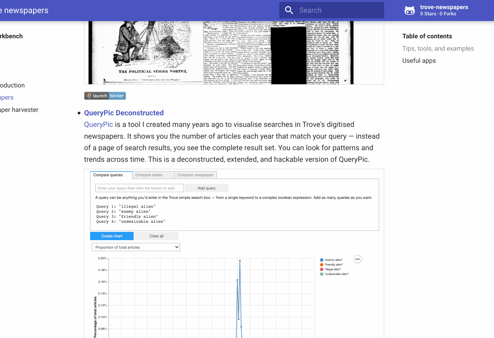

## Using Jupyter notebooks

Some general tips:

*   Code cells have boxes around them.
*   To run a code cell click on the cell and then hit **Shift+Enter**. The **Shift+Enter** combo will also move you to the next cell, so it’s a quick way to work through the notebook.
*   While a cell is running a **\*** appears in the square brackets next to the cell. Once the cell has finished running the asterix will be replaced with a number.
*   In most cases you’ll want to start from the top of notebook and work your way down running each cell in turn. Later cells might depend on the results of earlier ones.
*   To edit a code cell, just click on it and type stuff. Remember to run the cell once you’ve finished editing.

## Viewing notebooks on NBViewer

The links on the title of each notebook will open it in [NBViewer](https://nbviewer.jupyter.org/). NBViewer takes a notebook from a GitHub repository and renders it in a nice, readable way. However, this is a static view of the notebook. If you want to run the code or edit the notebook, you need to run it on Binder. Either click one of the buttons described below or the Binder icon in NBViewer's top menu bar.

## Running notebooks live on Binder

Each collection of notebooks includes a  button. When you click on the button, the [Binder](https://mybinder.org/) service opens the notebooks within a customised computing environment. This can take a little while — just be patient. Once Binder is ready, you'll be able to use all the notebooks live within your web browser. However, if you make any changes or download any data, Binder won't save them for you. You'll have to make sure you download any files you want to keep. In many cases the notebooks themselves will generate download links to make it easy for you to save your results. Binder sessions will also stop responding after after a period of inactivity — just start a new session.

## Running notebooks in &lsquo;app mode&rsquo;

Some of the workbench repositories make use of the [appmode extension](https://github.com/oschuett/appmode) for Jupyter notebooks. When you open a notebook in app mode, all the code cells are hidden and are run automatically as the notebook loads. This means you can make a notebook available with a nice clean interface for those who might be a little intimidated by a page full of code. But the code is still there. To view the underlying notebook, just click on the 'Edit App' button at the top of the page.

There are two ways to open a notebook in app mode. If you're in the normal notebook view you should see an appmode button in the menu bar, just click it. To make things easier, I've included  buttons under each app — when you click these buttons, the notebooks open on Binder in app mode. No extra clicks required.

## Running notebooks on your own computer

If you have Jupyter running on your own computer you can just clone, fork, or download the repository from GitHub. The link to the repository on GitHub is in the top navigation bar.

Once you have a local copy (preferably running in a virtual environment), you can install the siftware you need using the `requirements.txt` file.

~~More detail required~~
