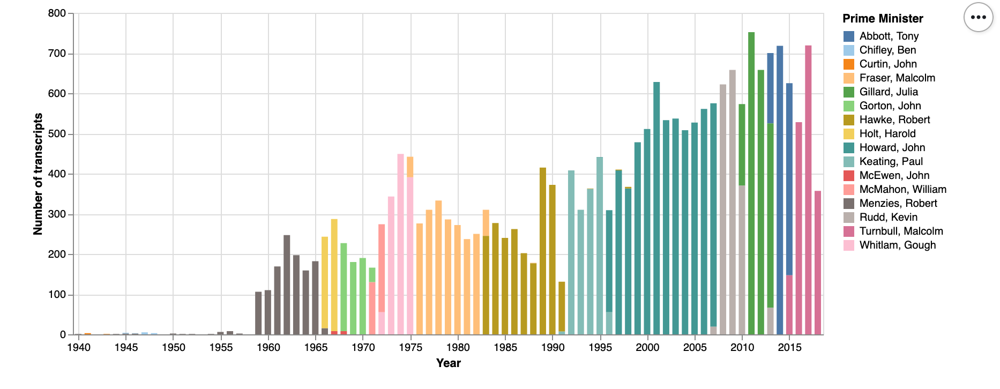

The Department of Prime Minister and Cabinet provides transcripts of more than [20,000 speeches, media releases, and interviews](https://pmtranscripts.dpmc.gov.au/about-collection) by Australian Prime Ministers. These transcripts can be [searched online](https://pmtranscripts.dpmc.gov.au/), and the underlying XML files [can be downloaded](https://pmtranscripts.dpmc.gov.au/developers) using a simple API. This repository includes Jupyter notebooks for harvesting, indexing, analysing, and aggregating the transcripts.

A [full harvest of the XML files from the PM Transcripts site](https://github.com/wragge/hansard-xml) is available if you don't want to do it yourself.

The XML files are made available by the Department of Prime Minister and Cabinet under a Creative Commons Attribution 3.0 Australia Licence.

## Tools, tips, and examples

### [Harvest transcripts](https://nbviewer.jupyter.org/github/GLAM-Workbench/pm-transcripts/blob/master/harvest_transcripts.ipynb)
Harvest all the XML transcripts from the PMs Transcripts site.

### [Create an index to the harvested files](https://nbviewer.jupyter.org/github/GLAM-Workbench/pm-transcripts/blob/master/index_and_analyse_transcript_metadata.ipynb)
The XML files contain embedded metadata that includes the name of the prime minister, and the title and date of the transcript. This notebook extracts that metadata from the harvested files and creates a CSV formatted spreadsheet for easy analysis. It also demonstrates some ways of summarising and visualising the metadata.

### [Aggregate transcripts](https://nbviewer.jupyter.org/github/GLAM-Workbench/pm-transcripts/blob/master/aggregate_transcripts.ipynb)  
Depending on how you want to analyse them, it can be useful to group the transcripts by prime minister. This notebook aggregates the transcripts in two ways: by extracting the text content of each XML file and combining them into one big text file, and by zipping up the original XML files.

## Data

### [Index to transcripts](https://github.com/GLAM-Workbench/pm-transcripts/blob/master/index.csv)

CSV formatted file containing metadata extracted from the XML transcripts. The fields are:

* `id` – transcript id
* `date` – release date
* `title`
* `pm` – prime minister's name
* `release_type` – type of transcript (speech, interview, media release etc)
* `subjects` – subjects (not used very often)
* `pdf` – url for PDF version (if there is one)

Note that the `release_type` and `subjects` fields are not used consistently. See the [create an index to the harvested files](https://nbviewer.jupyter.org/github/GLAM-Workbench/pm-transcripts/blob/master/index_and_analyse_transcript_metadata.ipynb) for more analysis of the metadata.

### [XML repository](https://github.com/wragge/hansard-xml)

Harvested: 11 July 2019

All of the harvested XML files are available from [this repository](https://github.com/wragge/hansard-xml). In addition to the original XML files, there is:

* a single zip file for each prime minister containing all their XML transcripts;
* a single text file for each prime minister containing the text extracted from all of their XML transcripts.
