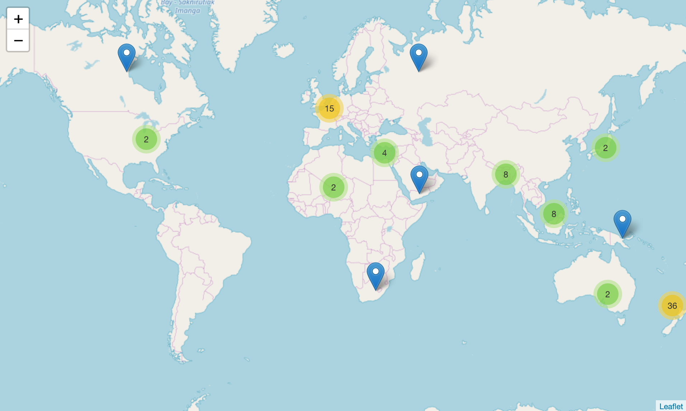

# Te Papa collections API

Te Papa has a [very well-documented API](https://data.tepapa.govt.nz/docs/index.html) that provides rich information about its collection and the relationships between collection items and other entities, including people and places.

You'll need [an API key](https://data.tepapa.govt.nz/docs/register.html) for serious exploration.

## Tips, tools, and examples

### [Exploring the Te Papa collection API](https://nbviewer.jupyter.org/github/GLAM-Workbench/te-papa-api/blob/master/Exploring-the-Te-Papa-collection-API.ipynb)  
This notebook is just a preliminary exploration of the API. It drills down through some of the facets to try and get a picture of what data is available.

### [Mapping Te Papa's collections](https://nbviewer.jupyter.org/github/GLAM-Workbench/te-papa-api/blob/master/Mapping-Te-Papa-collections.ipynb)  
This notebook creates some simple maps using the `production.spatial` facet of the Te Papa API to identify places where collection objects were created.

