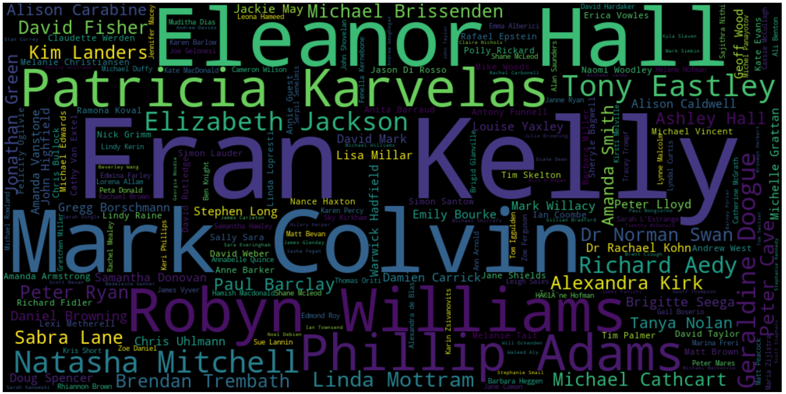

Trove's 'music' zone includes music, oral history interviews, and radio programs. You can access metadata from the music zone through the Trove API.

## Tips, tools, and examples

### Harvest ABC Radio National records from Trove
Trove harvests details of programs and segments broadcast on ABC Radio National. You can find them by searching for nuc:"ABC:RN" in the Music & Audio category. The records include basic metadata such as titles, dates, and contributors, but not full transcripts or audio. This notebook harvests, cleans, and saves all the available Radio National data from Trove.

* [Download from GitHub](https://github.com/GLAM-Workbench/trove-music/blob/master/harvest-abcrn.ipynb)
* [View using NBViewer](https://nbviewer.jupyter.org/github/GLAM-Workbench/trove-music/blob/master/harvest-abcrn.ipynb)
* [Run live on Binder](https://mybinder.org/v2/gh/GLAM-Workbench/trove-images/master?urlpath=lab/tree/harvest-abcrn.ipynb)

### Exploring ABC Radio National metadata
This notebook shows a few ways you can start to explore the ABC Radio National metadata harvested by the notebook above.

* [Download from GitHub](https://github.com/GLAM-Workbench/trove-music/blob/master/explore-abcrn-data.ipynb)
* [View using NBViewer](https://nbviewer.jupyter.org/github/GLAM-Workbench/trove-music/blob/master/explore-abcrn-data.ipynb)
* [Run live on Binder](https://mybinder.org/v2/gh/GLAM-Workbench/trove-music/master?urlpath=lab/tree/explore-abcrn-data.ipynb)

## Data

### ABC Radio National programs

The full harvest of ABC Radio National program metadata, containing more than 400,000 records is available for download from CloudStor in the following formats:

* [580mb JSONL file](https://cloudstor.aarnet.edu.au/plus/s/IZimT3iRDF80NY4/download) (or compressed as [100mb zip file](https://cloudstor.aarnet.edu.au/plus/s/HjeQzFg0mKfAwvS/download)) – JSONL saves each record as a JSON object, separated by line breaks
* [340mb CSV file](https://cloudstor.aarnet.edu.au/plus/s/v94chrTg9WBsPCP) (or compressed as [80mb zip file](https://cloudstor.aarnet.edu.au/plus/s/K7lGBo1fs9I3rHf/download))

You can also download CSVs for individual programs:

* [RN Breakfast](https://cloudstor.aarnet.edu.au/plus/s/quR0lZXr9OKrEV5/download)
* [RN Drive](https://cloudstor.aarnet.edu.au/plus/s/lgGEtjUdn2Qpxs0/download)
* [AM](https://cloudstor.aarnet.edu.au/plus/s/OxSqhRkp3NlV0Iz/download)
* [PM](https://cloudstor.aarnet.edu.au/plus/s/rZLNlEmLJ4lSiDo/download)
* [The World Today](https://cloudstor.aarnet.edu.au/plus/s/4XU14mWzCrudXHi/download)
* [Late Night Live](https://cloudstor.aarnet.edu.au/plus/s/ewP0XRg33PAXIMl/download)
* [Life Matters](https://cloudstor.aarnet.edu.au/plus/s/yR5AduNV7ycQZzd)
* [The Science Show](https://cloudstor.aarnet.edu.au/plus/s/VVvOt5C9YW2Ss40/download)

#### Data fields

Any of the fields other than `work_id` and `version_id` might be empty, though in most cases there should at least be values for `title`, `date`, `creator`, `contributor` and `isPartOf`.

* `work_id` – identifier for the containing work in Trove (you can use this to create a url to the item)
* `version_id` – an identifier for the version within the work
* `title` – title for the program or segment
* `isPartOf` – name of the program this is a part of
* `date` – ISO formatted date
* `creator` – usually just the ABC
* `contributor` – a list of names of those involved, such as the host, reporter or guest
* `publisher` – usually just the ABC
* `rights` – copyright information
* `type` – list of types (not sure how this differa from `format`)
* `format` – list of formats (not sure how this differs from `type`)
* `abstract` – text providing a summary of the program or segment (may incude multiple values)
* `subject` – list of subject tags (uncontrolled and very messy)
* `description` – truncated text fragment from the start of the transcript (may include multiple values)
* `fulltext_url` – link to the page on the ABC website where you can find more information
* `thumbnail_url` – link to a related thumbnail image on the ABC website
* `notonline_url` – not sure...
